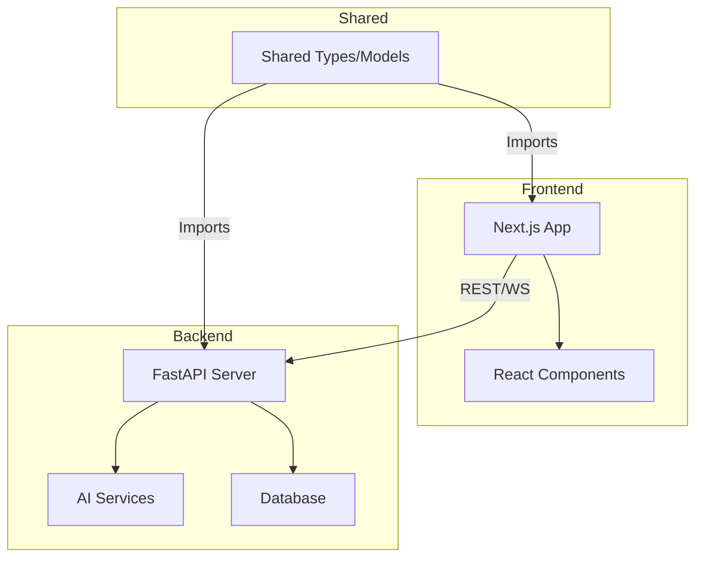

# Memora AI 🤖💬

Memora AI is a sophisticated AI-powered monorepo project featuring a FastAPI backend and a Next.js frontend.

## 🏗 Architecture



## 🚀 Getting Started

### Prerequisites

- Node.js 22+
- pnpm 10+
- Python 3.12+
- Docker (optional)

### Setup

1.  Clone the repository.
2.  Install dependencies:
    ```bash
    pnpm install
    ```
3.  Set up environment variables:
    ```bash
    cp .env.example .env
    ```
4.  Run the development server:
    ```bash
    pnpm dev
    ```

## 🛠 Tech Stack

- **Monorepo**: Turborepo + pnpm workspaces
- **Backend**: FastAPI (Python)
- **Frontend**: Next.js (TypeScript, Tailwind CSS)
- **AI**: OpenAI API
- **Database**: Supabase / PostgreSQL
- **Linting**: Ruff, Black, ESLint, Prettier
- **Analytics**: Vercel Analytics

## 📡 API Reference

### Base URL
`http://localhost:8000/api/v1`

### Endpoints

| Method | Endpoint | Description | Auth |
|--------|----------|-------------|------|
| GET | `/health` | API health check | No |
| POST | `/memory/reflect` | Reflect on conversation and summarize preferences | Yes |
| GET | `/profile/memory` | Retrieve candidate memory timeline | Yes |
| POST | `/matches` | Score job description against candidate profile | Yes |
| POST | `/cron/reflect-weekly` | Trigger weekly reflection for all candidates | No |
| GET | `/admin/activity` | List all system check-in activity | Yes |

Interactive docs available at `/docs` when running the backend.
