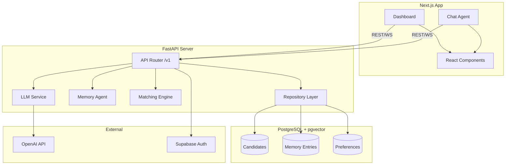

# Memora AI 🤖💬

Memora AI is a sophisticated AI-powered monorepo project featuring a FastAPI backend and a Next.js frontend, designed to manage candidate professional memories and match them with opportunities.

## 🏗 Architecture



## 🚀 Getting Started

### Prerequisites

- Node.js 22+
- pnpm 10+
- Python 3.12+
- Docker (optional)

### Local Setup

1.  **Clone the repository**:
    ```bash
    git clone https://github.com/ckih/Memora_ai.git
    cd Memora_ai
    ```

2.  **Install dependencies**:
    ```bash
    pnpm install
    ```

3.  **Set up environment variables**:
    ```bash
    cp .env.example .env
    ```
    *Fill in your Supabase and OpenAI keys in the `.env` file.*

4.  **Run migrations**:
    ```bash
    cd apps/backend
    alembic upgrade head
    ```

5.  **Run development servers**:
    You can run everything together:
    ```bash
    pnpm dev
    ```
    Or run them separately:
    ```bash
    pnpm dev:backend   # FastAPI on http://localhost:8000
    pnpm dev:frontend  # Next.js on http://localhost:3000
    ```

## 🌍 Deployment Guide

Memora AI is optimized for **Vercel**.

### Backend Deployment
1. Create a new Vercel project pointing to the `/apps/backend` root.
2. Add all backend environment variables from `.env.example`.
3. Vercel will automatically detect the Python environment and `vercel.json` configuration.

### Frontend Deployment
1. Create a new Vercel project pointing to the `/apps/frontend` root.
2. Add all `NEXT_PUBLIC_*` environment variables.
3. Configure `NEXT_PUBLIC_API_URL` to point to your backend deployment URL.

### Cron Jobs
The weekly reflection cron is automatically configured via `apps/backend/vercel.json`. Vercel will trigger it according to the defined schedule.

## 🛠 Extending the Agent

### Adding new Memory logic
1. Define a new model or update existing ones in `apps/backend/models/`.
2. Implement repository methods in `apps/backend/repositories/`.
3. Update `MemoryAgent` in `apps/backend/services/memory_agent.py` to incorporate the new logic.

### Adding new AI capabilities
1. Add new methods to `LLMService` for specific LLM tasks.
2. Integrate these into the `api/v1/endpoints` for frontend consumption.

## 📡 API Reference

### Base URL
`http://localhost:8000/api/v1`

### Endpoints

| Method | Endpoint | Description | Auth |
|--------|----------|-------------|------|
| GET | `/health` | API health check | No |
| POST | `/memory/reflect` | Reflect on conversation and summarize preferences | Yes |
| GET | `/profile/memory` | Retrieve candidate memory timeline | Yes |
| POST | `/matches` | Score job description against candidate profile | Yes |
| GET | `/cron/reflect-weekly` | Trigger weekly reflection for all candidates | No |
| GET | `/admin/activity` | List all system check-in activity | Yes |

Interactive docs available at `/docs` when running the backend.
